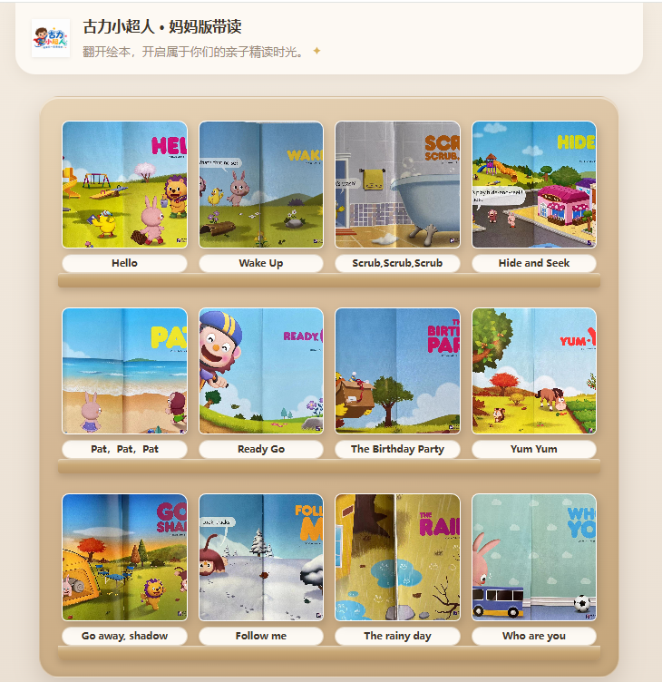

# 古力小超人 · 妈妈版带读

**线上体验 → [js0007.github.io/guli-superhero](https://js0007.github.io/guli-superhero/)**

---

## 这是什么？

这是一套给**妈妈**用的亲子英语精读「小抄」，配合家里的**纸质**《古力小超人》绘本一起用。

孩子捧着书看图画，妈妈用手机打开对应册数，就能照着读：

- **纸质书对照**：跨页图 + 页码，左手绘本、右手小抄，不会翻错页  
- **绘本扩展**：每页英文句子 + 中文参考，点喇叭可听发音  
- **互动指导**：分步骤提示怎么问、怎么带读、怎么跟读，不用自己临场编  
- **核心词汇**：当页重点词，点一下就能听  

全系列 **12 册** 已收录：从 *Hello*、*Wake Up* 到 *Who are you*，覆盖日常场景与亲子互动。



### 推荐使用方式

1. 用手机浏览器打开上方链接（可添加到主屏幕，当小 App 用）  
2. 书架点进正在读的那一本  
3. 翻到纸质书相同页码，播放「整页原音」或按互动指导带孩子读  
4. 不必一次读完，按孩子的节奏一页一页来就好  

---

## 目录结构（开发者）

```
古力小超人/
├── 原始素材/          # 图片、音频、Word 文稿（不部署）
├── 需求描述/
├── data/content/      # 带读 JSON 源数据
├── scripts/           # 构建脚本
└── site/              # ★ 部署此目录
    ├── index.html     # 书架首页
    ├── assets/        # 共用 CSS/JS/logo
    ├── templates/
    └── books/         # 各册带读页
```

## 构建

```powershell
# 仅重建站点（使用现有 data/content）
python scripts/build_all.py

# 从 Word 重新提取英文 → 翻译 → 丰富指导 → 构建站点
python scripts/build_daidu.py all
```

分步命令：

```powershell
python scripts/build_daidu.py extract    # → data/content/en/
python scripts/translate_content.py      # → data/content/
python scripts/enrich_guides.py          # 优化互动指导
python scripts/build_all.py              # → site/
```

## 本地预览

```powershell
cd site
python -m http.server 8080
```

浏览器打开 http://localhost:8080

## GitHub Pages 部署

线上地址：**https://js0007.github.io/guli-superhero/**

站点内容发布在 `gh-pages` 分支（`site/` 目录内容）。更新后执行：

```powershell
python scripts/build_all.py
powershell -File scripts/deploy_pages.ps1
```

或在 GitHub 仓库 **Settings → Pages** 确认 Source 为 `gh-pages` 分支、`/` 根目录。

## 依赖

- Python 3.10+
- `pip install deep-translator`（翻译步骤需要）
- 读取 `.doc` 需要 `pip install pywin32`（仅 Windows）
